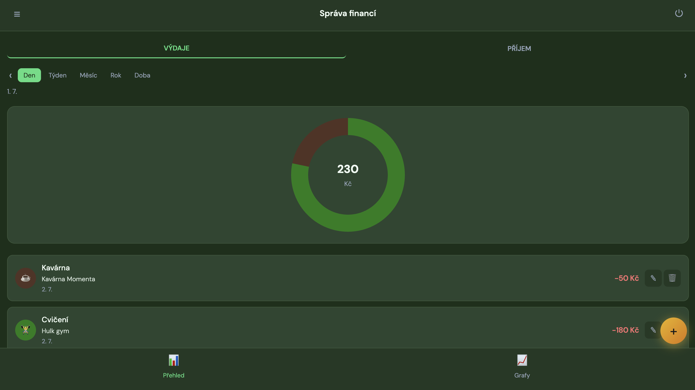
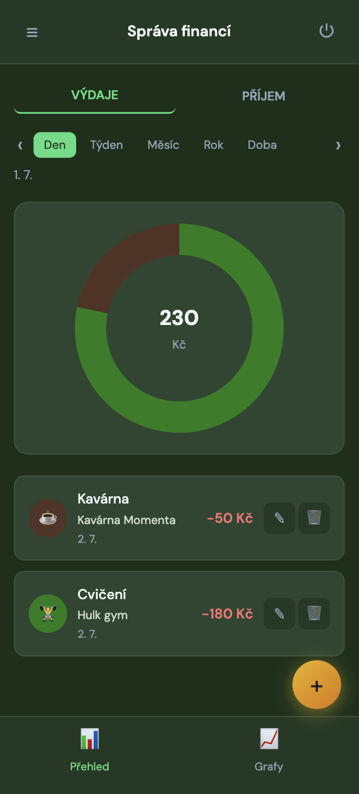
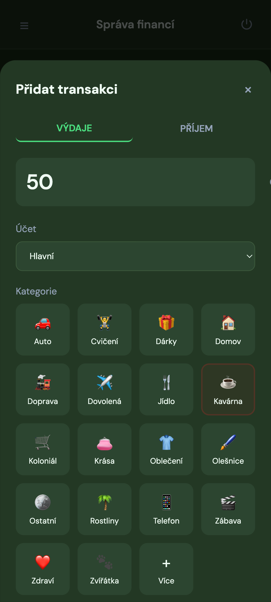
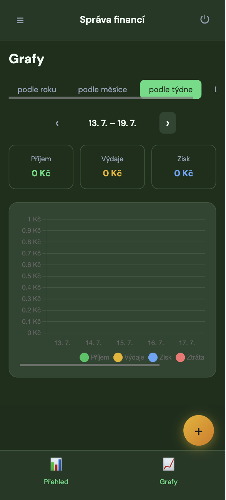

# Správa financí

Aplikace pro správu osobních financí vyvinutá ve Vue.js 3 s integrací Supabase.

## Náhledy

### Desktop



### Mobil

<p align="center">
  
  
  
</p>

<p align="center">
  <em>Přehled · Přidání platby · Grafy</em>
</p>

## Funkce

- **Registrace a přihlášení** – autentizace pomocí emailu a hesla
- **Hlavní obrazovka** – přepínání mezi příjmy a výdaji, donut graf a seznam transakcí
- **Období** – den, týden, měsíc, rok
- **Přidání transakce** – částka, kategorie, datum, komentář (tlačítko +)
- **Vlastní kategorie** – možnost přidat nové kategorie s ikonou a barvou
- **Záložka Grafy** – vizualizace příjmů, výdajů, zisku a ztráty sloupcovým grafem

## Instalace

```bash
npm install
```

## Konfigurace Supabase

1. Vytvořte projekt na [supabase.com](https://supabase.com)
2. V **SQL Editoru** v Supabase Dashboard spusťte celý skript ze souboru `supabase/schema.sql`
3. Pokud už databázi máte, spusťte navíc migraci `supabase/migrations/001_security_hardening.sql`
4. Zkopírujte `.env.example` na `.env` a vyplňte své hodnoty:
   - `VITE_SUPABASE_URL` – URL vašeho projektu (najdete v Project Settings → API)
   - `VITE_SUPABASE_ANON_KEY` – anonymní (anon) klíč (Project Settings → API)

## Spuštění

```bash
npm run dev
```

Aplikace poběží na `http://localhost:5173`

## Sestavení

```bash
npm run build
```
